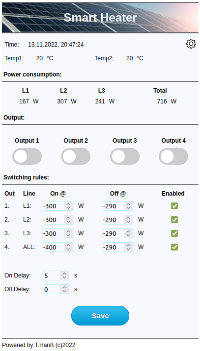

# ABL eMS home smart heater
## _A ESP32 project_

This project is written for a smart plug to turn on and off an electrical load depending on the excess energy from the photovoltaic array. The smart heater can fully controlled and configured via its own WebPage.  

## Function:
In my case, the smart meter was installed directly after the utility meter in order to see if the house is providing or receiving power.The smart heater opens a connection to the meter to get this information. The smart heater has four relay. A mains phase is assigned to each relay. The fourth relay refers to the total consumption. They switching on and off via adjustable current consumption / delivery threshold values.

## Hardware:
Own small PCB for a standard DIN rail housing.

## eMS API description:
Since ABL didn't provide me with an API for its eMS home Smartmeter, I reverse engineered the web interface and poured it into C++ code.
I used eMS home software version V1.1 (https://www.ablmobility.de/de/emobility-blog/softwareupdateemshome.php)
The eMS uses a WebSocket connection to provide all readings at its web page. Once the connection is established, the server sends a packet every 250ms. It contains all measured values as well as the mains frequency, which is the only one that is not displayed on its website. 
However, the data format used here is rubbish. To be honest, I didn't understand it and stupidly followed the JavaScript code. So don't worry if you don't understand this part of the code.
To establish the WebSocket connection you have to have a access token. A simple POST message with the eMS password is sufficient to receive this token.
Fun Fact: The eMS enforces a 12-digit password on its website and then sends it unencrypted to its server. This is how it has to be done folks, a longer PW makes the system more secure ;-)
It's all encapsulated into the eMShome class.

## Development environment:
It's a MS Visual Studio Code project using the Platform IO plugin.

Extern libs:
- paulstoffregen/OneWire@^2.3.7
- milesburton/DallasTemperature@^3.11.0
- knolleary/PubSubClient@^2.8
- bblanchon/ArduinoJson@^6.19.4
- gilmaimon/ArduinoWebsockets@^0.5.3 --->> NOTE: This lib was altert 
in order to get it working with the eMS home